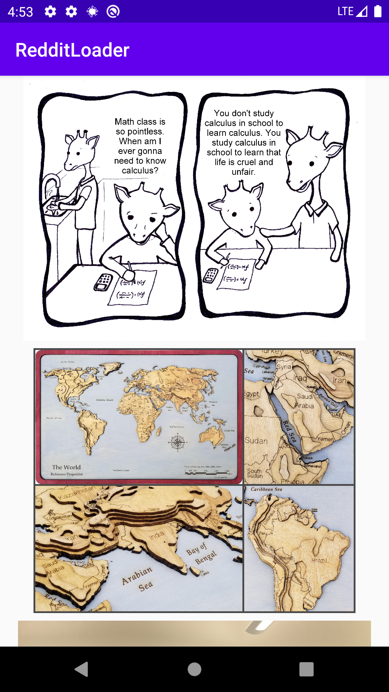

# RedditLoader
A Reddit Image Loader with custom image loader library and multimodule setup.

***You can Install and test latest RedditLoader app from below 👇***

<table style="width:100%">
  <tr>
    <th>Screen_1</th>
    <th>Screen_2</th>
  </tr>
  <tr>
    <td></td>
    <td></td>
  </tr>
</table>

## About
- It load the imagees from [Reddit API](https://www.reddit.com/r/images/hot.json).
- It loads the image Asynchronously and uses the custom ImageLoader](https://github.com/Zaraki596/RedditLoader/blob/master/imageloader/src/main/java/com/example/imageloader/ImageLoader.kt).
- It have multimodule setup with incremental compile time speed.

## Built With 🛠
- [Kotlin](https://kotlinlang.org/) - First class and official programming language for Android development.
- [Coroutines](https://kotlinlang.org/docs/reference/coroutines-overview.html) - For asynchronous and more.
- [Android Architecture Components](https://developer.android.com/topic/libraries/architecture) - Collection of libraries that help you design robust, testable, and maintainable apps.
  - [LiveData](https://developer.android.com/topic/libraries/architecture/livedata) - Data objects that notify views when the underlying database changes.
  - [ViewModel](https://developer.android.com/topic/libraries/architecture/viewmodel) - Stores UI-related data that isn't destroyed on UI changes.
- [Retrofit](https://square.github.io/retrofit/) - A type-safe HTTP client for Android and Java.
- [ImageLoader](https://github.com/Zaraki596/RedditLoader/blob/master/imageloader/src/main/java/com/example/imageloader/ImageLoader.kt) - A custom made image loader library by [Rohan Singh](https://github.com/Zaraki596)
- [Moshi Converter](https://github.com/square/retrofit/tree/master/retrofit-converters/moshi) - A Converter which uses Moshi for serialization to and from JSON.
